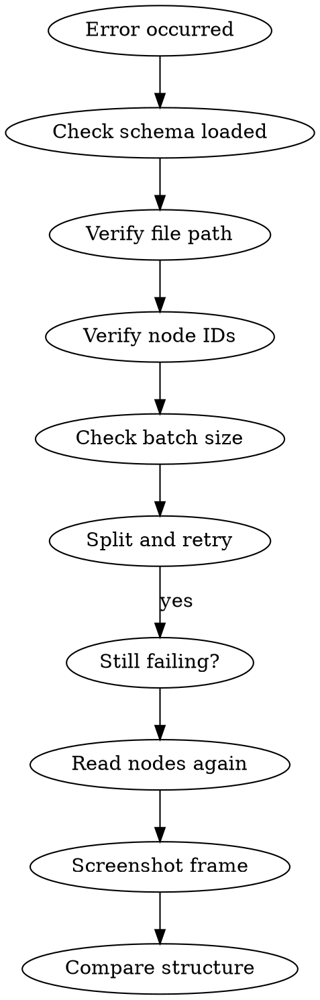

# Super Pencil Troubleshooting

## Overview

Diagnose and fix Pencil MCP errors, vague failures, and silent failures where edits appear to do nothing.

## Quick Reference

| Error | First Check | Fix |
|-------|-------------|-----|
| `null`/vague | Schema loaded? | `get_editor_state(include_schema=true)` |
| `batch_design` fails | Batch size | Split to <25 ops |
| Edits do nothing | Node ID real? | `batch_get` to verify |
| Text disappears | `textGrowth`? | Add `textGrowth:"auto"` |
| Path wrong position | Geometry local? | Rewrite with `M0 0` |
| Layout broken | Too many patches | Rebuild from working file |

## When to Use

- MCP returns `null` or vague error
- `batch_design` fails
- Edits visually do nothing
- Text disappears
- Layout broken after changes

## Quick Diagnosis

### If MCP returns `null` or vague failure

Check:
- [ ] Did you read schema with `get_editor_state(include_schema=true)`?
- [ ] Is file path absolute and correct?
- [ ] Is node ID real (verified with `batch_get`)?
- [ ] Did you exceed 25 operations in one batch?
- [ ] Are you reusing binding names from old batches?
- [ ] Are you updating a deleted/replaced node?
- [ ] Do text nodes have `textGrowth` when width is set?
- [ ] Are path nodes consistent in geometry vs bounds?
- [ ] Are you working outside placeholder frame?

### If `batch_design` fails

**Common causes:**
- Invalid operation syntax
- Reusing old binding names
- Node property violates schema
- Too many operations in one block
- Parent node doesn't exist or is wrong

**Fix pattern:**
1. Split into smaller chunks (max 25 ops)
2. Remove optional complexity
3. Re-run with 1-2 updates only
4. Rebuild incrementally

### If path renders incorrectly

See `super-pencil-path-debugging` for detailed diagnosis.

Quick checks:
1. Screenshot isolated frame
2. Read with `includePathGeometry: true`
3. Compare `x/y` with geometry span
4. Rebuild with local coordinates
5. Move to simpler parent if still unstable

### If text disappears

**Most common causes:**
- Missing `fill`
- Missing `textGrowth`
- Width set without proper growth mode

**Rules:**
- Use `textGrowth:"auto"` for natural-size text
- Use `textGrowth:"fixed-width"` if width is controlled

### If edits do nothing

**Likely causes:**
- Wrong node ID
- Editing duplicate (not visible node)
- Looking at wrong frame
- File not actually active
- Parent frame clipping result

**Fix:**
1. Re-run `get_editor_state`
2. Re-read top-level nodes
3. Screenshot exact target frame

### If layout broken after many changes

**Do not keep stacking fixes.**

**Safer options:**
- Delete bad nodes, recreate them
- Replace whole parent frame
- Copy working pattern from another `.pen` file

## Error Prevention

### Before editing
1. Load schema first
2. Read target nodes
3. Set placeholder on working frame

### During editing
1. Max 25 operations per batch
2. Fresh binding names every call
3. Screenshot after each batch

### After editing
1. Verify visually with screenshot
2. Remove placeholder flag

## Debugging Playbook

## Recovery Strategy

When all else fails:

1. **Stop editing** - more patches make it worse
2. **Read current state** - `get_editor_state` + `batch_get`
3. **Screenshot** - prove what's actually rendered
4. **Compare with working file** - find structural differences
5. **Rebuild from working pattern** - copy successful structure

## Related Skills

- **Core workflow:** Use `super-pencil-core` for standard editing
- **Antipatterns:** Use `super-pencil-antipatterns` to avoid common mistakes
- **Path debugging:** Use `super-pencil-path-debugging` for path rendering issues
